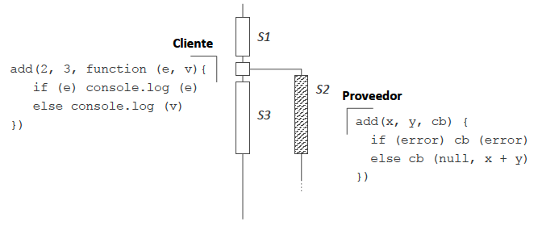
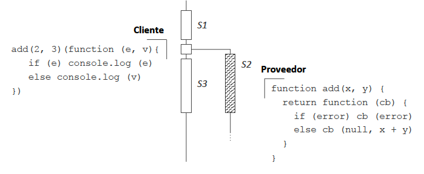

# EVENTOS ASÍNCRONOS

## Programación asíncrona

La programación asíncrona promueve la definición de operaciones **no bloqueantes**.


<small>figura por <cite>Javier Vélez Reyes, [Programación asíncrona en JavaScript](https://github.com/javiervelezreyes/Talleres.uca.programacion-asincrona)</cite></small>

Las funciones no bloqueantes afectan a:

- El **estado** del programa
- La lógica de **continuación** del programa

 programación secuencial   |  programación asíncrona
:-------------------------:|:-------------------------:
 | 
<small>figura por <cite>Javier Vélez Reyes, [Programación asíncrona en JavaScript](https://github.com/javiervelezreyes/Talleres.uca.programacion-asincrona)</cite></small>


### Modelos de paso de <a id="continuaciones">continuaciones</a>

Aumentar la aridad de la función no bloqueante en 1 argumento adicional, donde se indica la lógica de continuación.

#### Callbacks

La lógica de continuación se indica mediante una función de **retrollamada** o _callback_.


<small>figura por <cite>Javier Vélez Reyes, [Programación asíncrona en JavaScript](https://github.com/javiervelezreyes/Talleres.uca.programacion-asincrona)</cite></small>


Ejemplos: implementaciones de _listener_ del [ejercicio introductorio](#a-idlistenersejercicio-introductorio---listenersa)

- Con clases anónimas
- Con adaptadores
- Con funciones anónimas o lambdas

##### Ejemplo: Ajax + jQuery callbacks

- [Ajax](http://learn.jquery.com/ajax/)
- [jQuery](http://devdocs.io/jquery/)
- [jQuery Callbacks object](http://devdocs.io/jquery-callbacks-object/)

##### Ejemplo: callback en TypeScript

```typescript
function delayedResponseWithCallback(callback: Function) {
    function delayedAfterTimeout() {
        console.log(`delayedAfterTimeout`);
        callback();
    }
    setTimeout(delayedAfterTimeout, 1000);
}

function callDelayedAndWait() {
    function afterWait() {
        console.log(`afterWait`);
    }
    console.log(`calling delayedResponseWithCallback`);
    delayedResponseWithCallback(afterWait);
    console.log(`after calling delayedResponseWithCallback`);
}
callDelayedAndWait();
```

Salida:

```text
calling delayedResponseWithCallback
after calling delayedResponseWithCallback
delayedAfterTimeout
afterWait
```

El uso de callbacks hace el código complejo, repetitivo y difícil de entender, especialmente cuando el tamaño del código crece.

#### Thunks

**[thunk](https://en.wikipedia.org/wiki/Thunk)** = subrutina empleada para inyectar un cómputo adicional en otra subrutina

- Difieren un cómputo hasta que éste se necesita
- Insertan una operación al principio o al final de otra
- Aumentan la aridad de la función no bloqueante en una fase adicional de evaluación parcial para recibir la lógica de continuación
- Un thunk puede guardar su estado final para evitar recalcularlo (_memoization_)



<small>figura por <cite>Javier Vélez Reyes, [Programación asíncrona en JavaScript](https://github.com/javiervelezreyes/Talleres.uca.programacion-asincrona)</cite></small>

##### Lenguajes: Ruby

- Cualquier función en Ruby puede recibir un **bloque** `do`... `end` como argumento adicional (no explícito) a la llamada
- Un _thunk_ es como un bloque con un `yield` al final

#### <a id="promesas">Promesas</a>

Modelo de [futuros y promesas](https://en.wikipedia.org/wiki/Futures_and_promises)

- **Futuro**: marcador de posición (_placeholder_), de solo lectura, para una variable que representa el resultado de un cómputo asíncrono
- **Promesa**: contenedor de una asignación escribible (solo para inicialización), que fija el valor de un _futuro_.

En programación funcional, los futuros y promesas sirven para desacoplar un valor (el futuro) de cómo éste se calculó (la promesa), permitiendo así la paralelización de los cálculos.


<small>figura por <cite>Javier Vélez Reyes, [Programación asíncrona en JavaScript](https://github.com/javiervelezreyes/Talleres.uca.programacion-asincrona)</cite></small>


El cliente recibe como respuesta inmediata una abstracción de datos (la promesa) que representa un compromiso de valor futuro, con inyectores (then, catch) para incluir la lógica de continuación.

Se pueden encadenar cálculos usando futuros _computables_ o _escuchables_, que sirven para indicar a un thread que ejecute una determinada tarea y, cuando termine, se dirija a hacer otra tarea usando el resultado de la tarea anterior.

##### Lenguajes: TypeScript

En TypeScript, una `Promise<T>` es un objeto que, en su creación, recibe una función (anónima o no) que acepta dos callbacks (`resolve` y `reject`) y devuelve un valor de tipo `T`.

###### Ejemplo: definición de promesa que resuelve

```typescript
function delayedPromise(): Promise<void> {
    return new Promise<void>
    (
        // función anónima con dos callbacks como argumentos
        (   resolve : () => void,   //callback para resolver
            reject: () => void      //callbak para rechazar
        ) => {
            // función que resuelve tras un timeout de 1 sg.
            function afterTimeout() {
                resolve();
            }
            setTimeout(afterTimeout, 1000);
        }
    );
}
```

###### Ejemplo: uso para resolver

```typescript
function callDelayedPromise() {
    console.log(`calling delayedPromise`);
    delayedPromise().then(
        // función anónima a llamar cuando se resuelva la promesa
        () => { console.log(`delayedPromise.then()`) }
    );
}

callDelayedPromise();
```

Salida:

    calling delayedPromise
    delayedPromise.then()

###### Ejemplo: definición de promesa que rechaza

```typescript
function errorPromise(): Promise<void> {
    return new Promise<void>
    (
        (   resolve: () => void,
            reject: () => void
        ) => {
            reject();
        }
    );
}
```

###### Ejemplo: uso para rechazar

```typescript
function callErrorPromise() {
    console.log(`calling errorPromise`);
    errorPromise().then(
        () => { console.log(`no error.`) }
    ).catch(
        () => { console.log(`an error occurred`)}
    );
}

callErrorPromise();
```

Salida:

    calling errorPromise
    an error occurred

##### Comparación callbacks-promises en TypeScript

###### Mecanismo de los callback

```typescript
function standardCallback() {
    function afterCallbackSuccess() {
    // execute this code
    }
    function afterCallbackError() {
    // execute on error
    }
    // invoke async function
    invokeAsync(afterCallbackSuccess, afterCallbackError);
}
```

###### Sintaxis (_fluent_) de las promesas

```typescript
function usingPromises() {
    // invoke async function
    delayedPromise().then(
        () => {
            // execute on success
        }
    ).catch (
        () => {
            // execute on error
        }
    );
}
```

##### Async/await

- El prefijo `await` hace que se espere a que se llame a la función asíncrona antes de continuar con la ejecución del programa.
- Esto genera un flujo de ejecución de la lógica del programa más fácil de leer y de seguir, pausando la ejecución hasta que se cumpla la promesa.

```typescript
function awaitDelayed(): Promise<void> {
    return new Promise<void> (
        (   resolve: () => void,
            reject: () => void ) =>
            {
                function afterWait() {
                    console.log(`calling resolve`);
                    resolve();
                }
                setTimeout(afterWait, 1000);
            }
        );
}

async function callAwaitDelayed() {
    console.log(`call awaitDelayed`);
    await awaitDelayed();
    console.log(`after awaitDelayed`);
}
callAwaitDelayed();
```

Salida:

```text
call awaitDelayed
calling resolve
after awaitDelayed
```

###### Comparación sintaxis then/catch y async/await

Promesas que usan then/catch para definir funciones anónimas a llamar dependiendo del resultado éxito/fracaso de la ejecución:

```typescript
function simplePromises() {
    // invoke async function
    delayedPromise().then(
        () => {
            // execute on success
        }
    ).catch (
        () => {
            // execute on error
        }
    );
    // code here does NOT wait for async call
}
```

Sintaxis async/await, más legible y menos propensa a errores:

```typescript
async function usingAsyncSyntax() {
    try {
        await delayedPromise();
        // execute on success
    } catch(error) {
        // execute on error
    }
    // code here waits for async call
}
```

##### Lenguajes: Java

En Java hay definida una interfaz explícita para los futuros:

- Desde Java 5: [`java.util.concurrent.Future`](https://docs.oracle.com/javase/9/docs/api/java/util/concurrent/Future.html) 
- Desde Java 8, inspirado por los [`ListenableFuture`](https://github.com/google/guava/wiki/ListenableFutureExplained) de Guava: [`java.util.concurrent.CompletableFuture`](https://docs.oracle.com/javase/9/docs/api/java/util/concurrent/CompletableFuture.html)

###### Ejemplo: `Future` en Java

```java
// Callable<V> = Interfaz funcional que representa a una operación sin args
// y que devuelve un resultado de tipo V (permite checked exceptions)
public static class MyCallable implements Callable<Integer> {
    @Override
    public Integer call() throws Exception {
        Thread.sleep(1000);
        return 1;
    }
}

public static void main(String[] args) throws Exception{
    ExecutorService exec = Executors.newSingleThreadExecutor();
    Future<Integer> f = exec.submit(new MyCallable());
    System.out.println(f.isDone()); //False
    System.out.println(f.get()); //Waits until the task is done, then prints 1
}
```

###### Ejemplo: `CompletableFuture` en Java

```java
// Supplier<T> = Interfaz funcional que representa a una operación sin args
// y que devuelve un resultado de tipo T (no permite checked exceptions)
public static class MySupplier implements Supplier<Integer> {
    @Override
    public Integer get() {
        try {
            Thread.sleep(1000);
        } catch (InterruptedException e) {
            //Do nothing
        }
        return 1;
    }
}

public static class PlusOne implements Function<Integer, Integer> {
    @Override
    public Integer apply(Integer x) {
        return x + 1;
    }
}

public static void main(String[] args) throws Exception {
    ExecutorService exec = Executors.newSingleThreadExecutor();
    CompletableFuture<Integer> f = CompletableFuture.supplyAsync(new MySupplier(), exec);
    System.out.println(f.isDone()); // False
    CompletableFuture<Integer> f2 = f.thenApply(new PlusOne());
    System.out.println(f2.get()); // Waits until the "calculation" is done, then prints 2
}
```

#### Lenguajes, JavaScript

> LECTURA recomendada: [Promises/A+](https://promisesaplus.com/): An open standard for sound, interoperable JavaScript promises.

