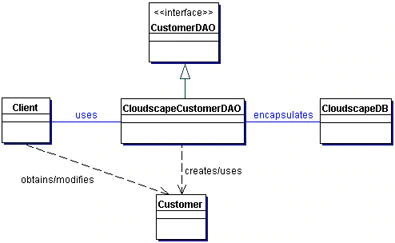
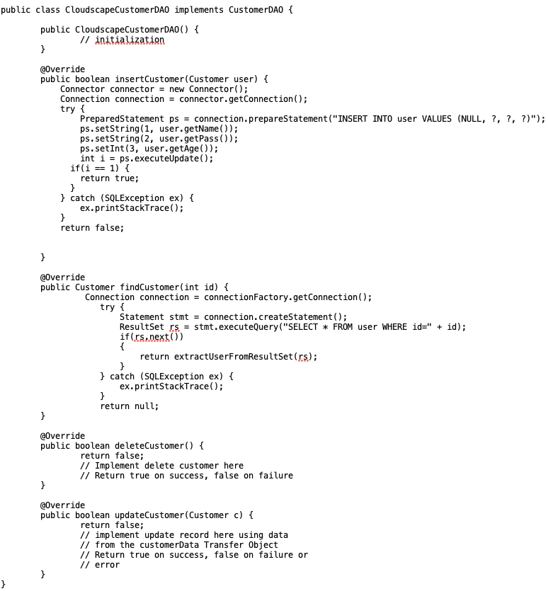
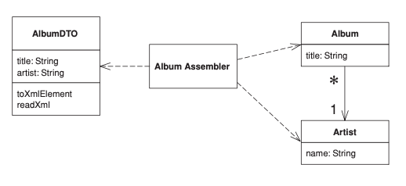
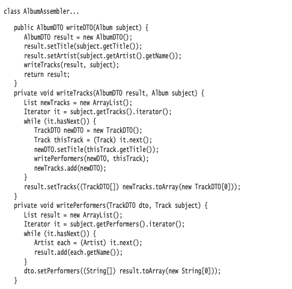

<!-- size: 16:9 -->
<!-- theme: default -->

# DISEÑO DE SISTEMAS SOFTWARE

 

## Bloques

1. Principios de diseño OO
2. Patrones de diseño
3. Arquitectura de software

---

# PATRONES DE DISEÑO 

---

## Índice de contenidos

1. Introducción
2. Patrones del GoF
3. Patrones específicos

---
## Introducción

---
### Origen de los patrones de diseño

- Los patrones de diseño surgen a partir del libro *A Pattern Language: Towns, Buildings, Construction* de Cristopher Alexander.

- La inspiración del libro fueron las ciudades medievales, atractivas y armoniosas, que fueron construidas según regulaciones locales que requerían ciertas características, pero que permitían al arquitecto adaptarlas a situaciones particulares.

- En el libro se suministran reglas e imágenes y  se describen métodos exactos para construir diseños prácticos, seguros y atractivos a cualquier escala. También recopila modelos anteriores (con ventajas/desventajas) con el fin de usarlos en un futuro.

- El libro recomienda que las decisiones sobre la construcción de edificios se tomen de acuerdo al ambiente preciso de cada proyecto. 

 

---
### Diseño de software con patrones

- Conocer un lenguaje OO no te hace un buen diseñador. ¿Qué diferencia hay entre los diseñadores expertos y los novatos? Que los primeros usan recetas exitosas para los problemas habituales y no reinventan la rueda continuamente.

- Un grupo de expertos (_Gang of Four_) se basó en el trabajo de Alexander y lo aplicó al diseño de software, presentando el libro *Design Patterns* con un total de 23 patrones.

---
### Patrones de diseño

- Patrón de diseño: Una **solución general** a un **problema general** que puede adaptarse a un problema concreto

- La aplicación de patrones depende del **contexto**. 

- Ofrece un **vocabulario** de patrones (una jerga entre ingenieros de software)

- Los patrones **clásicos** son ampliamente conocidos: algunos muy aceptados y otros más discutidos...

- Deben usarse con cuidado. Deben simplificar el modelo, **no complicarlo**, por lo que deben surgir de manera natural.

- Han surgido nuevos patrones **específicos** de dominio: patrones de interfaces de usuario, patrones para la integración de aplicaciones empresariales, patrones de flujos de trabajo BPMN, patrones de concurrencia, etc.

---
## Patrones del Gang of Four

---

### Patrones creacionales

Corresponden a patrones de diseño de software que solucionan problemas de creación de instancias. Nos ayudan a encapsular y abstraer dicha creación. Vamos a ver:

- Factory Method
- Abstract Factory

Pero hay más...
- *Prototype*
- *Builder*
- *Singleton*

---

### Patrones estructurales

Son los patrones de diseño software que solucionan problemas de composición/agregación de clases y objetos. Vamos a ver:

- Composite
- Decorator
- Adapter

Pero hay más..
- *Facade*
- *Bridge*
- *Flyweight*
- *Proxy*

---
### Patrones de comportamiento
Son los relativos a la interacción y responsabilidades entre clases y objetos. Veremos:

- Command
- Observer 
- Strategy
- Visitor

Pero hay más...
- Template method
- Chain of Responsibility
- Interpreter
- Iterator
- Mediator
- Memento
- State

---
## Factory Method

---
## Command

---
## Composite

---
## Adapter

---
## Decorator

---
## Strategy

---
## Observer

---
## Visitor

---
## Otros patrones de interés
---

### Data Acess Object (DAO)

- Se usa para abstraer y encapsular los accesos a las fuentes de datos, con independencia del soporte concreto de almacenamiento. Su alternativa es el patrón *Active Record*.

---

---
### Data Transfer Object (DTO)

- Se usa para crear objetos planos (POJO) que puedan ser enviados o recuperados desde servidores remotos en una única invocación. Un DTO no tiene más comportamiento que almacenar y entregar sus propios datos (métodos *getters* y *setters*). 

---

---

# Para profundizar sobre patrones
- Martin Fowler – [Patterns in Enterprise Software](https://martinfowler.com/articles/enterprisePatterns.html): Catálogos de patrones a distintos niveles
    - Martin Fowler – [Patterns of Enterprise Application Architecture (EAA)](https://martinfowler.com/eaaCatalog/)
    - Hohpe y Woolf – [Enterprise Integration Patterns (EIP)](http://www.enterpriseintegrationpatterns.com/)
    - Buschmann y otros – [Pattern-Oriented Software Architecture (POSA)](http://www.amazon.com/exec/obidos/ASIN/0471958697) Volume 1: A system of patterns
- Peter Norvig – [Design Patterns in Dynamic Programming](http://www.norvig.com/design-patterns/design-patterns.pdf): Implementaciones más simples para los patrones de diseño del GoF en lenguajes dinámicos

---
# Para profundizar sobre patrones

- David Arno – [Are design patterns compatible with modern software techniques?](http://www.davidarno.org/2013/06/17/are-design-patterns-compatible-with-modern-software-techniques/)
- Implementaciones de los patrones de diseño del GoF en diversos lenguajes de programación:
    - Kamran Ahmed – [Design Patterns for Humans!](https://github.com/kamranahmedse/design-patterns-for-humans/blob/master/README.md): Explicación de los patrones de diseño del GoF implementados en PHP
    - Márk Török – [Design Patterns in TypeScript](https://github.com/torokmark/design_patterns_in_typescript)
    - Bogdab Vliv - [Design Patterns in Ruby](https://bogdanvlviv.com/posts/ruby/patterns/design-patterns-in-ruby.html)
- Lewis y Fowler – [Microservicios](https://martinfowler.com/articles/microservices.html)
- Chris Richardson - [Microservices patterns](https://microservices.io/)
